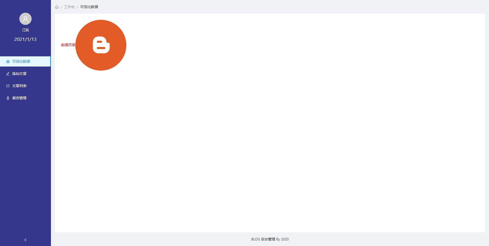

# personal-blog

#### 介绍以及文件
这是应该个人博客项目
*  admin ······ **使用React Hook + Andt + Axios 搭建的blog管理后台**
*  blog-app ······ **使用Next.js + Antd 搭建的blog前端页面**
*  service ······ **使用egg.js 搭建的后端服务**

### 项目预览

#### 安装教程

1.  xxxx
2.  xxxx
3.  xxxx

#### 使用说明

1.  npm i 或者 使用yarn 
2.  
3.  xxxx

