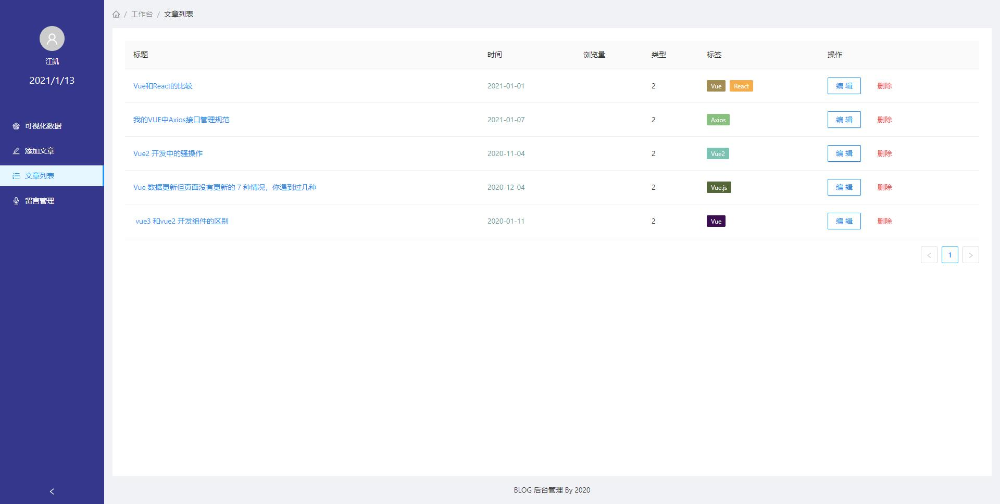

# personal-blog

#### 介绍以及文件
这是应该个人博客项目
*  admin ······ **使用React Hook + Andt + Axios 搭建的blog管理后台**
*  blog-app ······ **使用Next.js + Antd 搭建的blog前端页面**
*  service ······ **使用egg.js 搭建的后端服务**
*  antd-pro ······ **阿里的andt-admin 后续考虑admin向该项目迁移**
*  mysql ······ **数据库表结构**
*  README_files ······ readme.md中使用到的图片 真实项目当中无用

### 项目预览图片

#### 安装教程
1.  npm i 或者 使用yarn 
2.  admin 运行使用yarn start 或者npm run start
3.  blog-app 运行使用yarn dev 或者 npm run dev
4.  servece 需要连接数据库 数据库使用的是mysql,需要本地有数据库 。如果使用其他数据库可参照egg.js官方文档自行更改。

#### 后续慢慢更新新功能与页面，敬请期待 感谢

